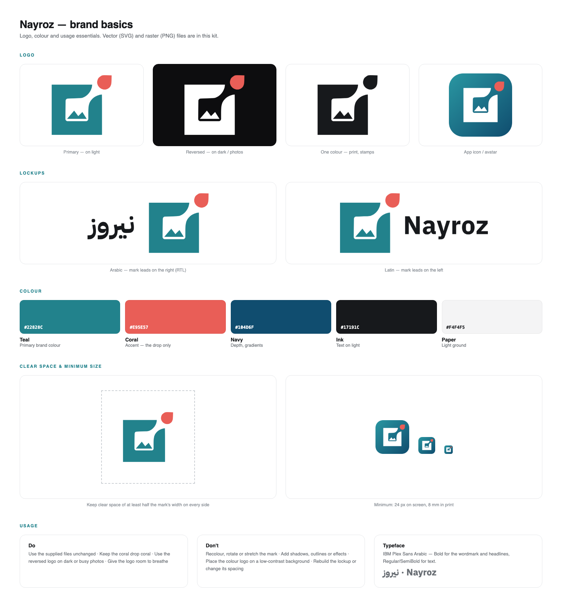

# Nayroz brand kit in the dashboard

The kit ships as `nayroz-brand-kit.zip`. Its files are copied into
`public/brand/` **unmodified** — do not hand-edit them. If the kit is reissued,
replace the files and re-check the token values below.

## Colour

| Role     | Hex       | Token          | Where it is used                            |
| -------- | --------- | -------------- | ------------------------------------------- |
| Teal     | `#22828C` | `--brand-teal` | Primary: buttons, focus rings, active states |
| Coral    | `#E95E57` | `--brand-coral`| **The drop in the mark only** — and charts   |
| Navy     | `#104D6F` | `--brand-navy` | Depth, the gradient's far end, charts        |
| Ink      | `#17191C` | `--brand-ink`  | Text on light; the dark-mode page ground     |
| Paper    | `#F4F4F5` | `--brand-paper`| The light page ground                        |
| Gradient | `#2A97A2 → #104D6F` @ 135° | `--brand-gradient` | The app icon              |

Coral is an accent for the mark, not a UI colour. Resist reaching for it on
buttons, links, or badges — the kit reserves it for the drop.

Everything else derives from these. `src/app/globals.css` declares the brand
block once at the top of `:root`; the neutral ramp is anchored to Ink
(`--shade-02`) and Paper (`--shade-09`), and the remaining steps keep their
original lightness while picking up Ink's cool cast so dark surfaces sit with
the teal rather than against it. Dark mode lifts teal to `--brand-teal-light`
(`#3DB2BD`) because the kit teal is too dim below `#17191C`.

## Typeface

IBM Plex Sans Arabic — loaded in `src/app/layout.js` via `next/font/google` at
weights 400/500/600/700, `arabic` + `latin` subsets. It covers both scripts, so
Arabic UI copy renders in the brand family instead of a system fallback. The CSS
variable is still named `--font-geist-sans` so every existing reference picks it
up unchanged.

## Marks

Use `src/components/brand/NayrozLogo.js` rather than referencing files directly:

- `<NayrozMark>` — the mark alone, `tone` of `color` / `white` / `white-solid` / `black`
- `<NayrozIcon>` — the mark on the gradient, `shape` of `rounded` / `square`
- `<NayrozLockup>` — mark + wordmark, `locale` of `en` / `ar`

The component enforces the ratio and the 24px floor. Clear space is the caller's
job: leave at least half the mark's width on every side.

Never recolour, rotate, or stretch the mark. The drop stays coral.

## Icons and metadata

| File                    | Purpose                                        |
| ----------------------- | ---------------------------------------------- |
| `src/app/icon.svg`      | Tab icon (the kit's `web/favicon.svg`)          |
| `src/app/favicon.ico`   | Legacy `/favicon.ico`, 16/32/48 from the kit PNGs |
| `src/app/apple-icon.png`| 180px touch icon                                |
| `src/app/manifest.js`   | Installed-app name, colours, and icons          |

Share cards use `public/brand/social/nayroz-og-1200x630.png`, wired up in the
root layout's `openGraph` / `twitter` metadata.

## Not yet on brand

`src/components/editor/PageBar.tsx` carries its own hardcoded slate palette
(`#eef1f5`, `#1f2a39`, `#8a93a6`, …) and is light-mode only. Its teal literals
are already the exact brand teal, but the neutrals are off-palette.
